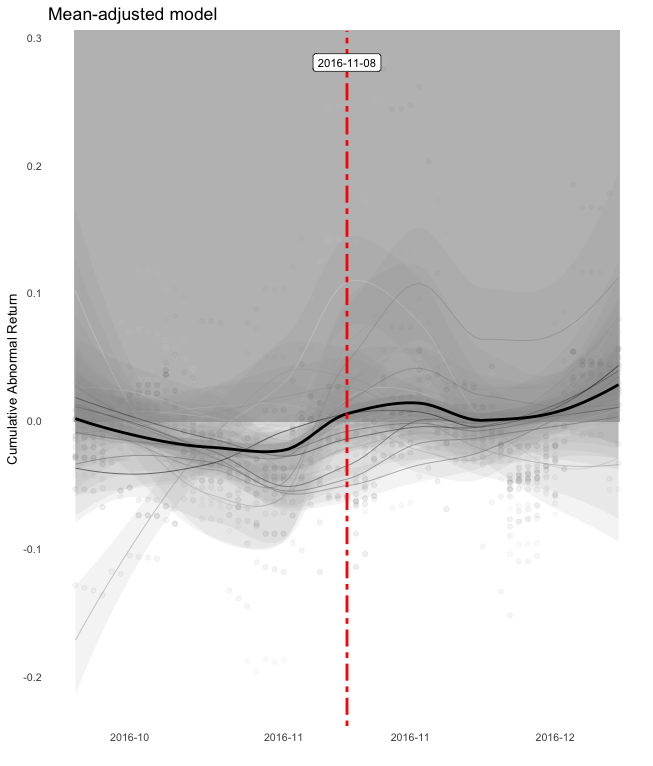

# event2car 

<!-- badges: start -->
[](https://travis-ci.org/LisaLechner/event2car)
[](https://ci.appveyor.com/project/LisaLechner/event2car)
<!-- badges: end -->

The event2car package allows users to generate *Cumulative Abnormal Returns*
(CAR) of one or multiple events.

## Installation

You can install the released version of event2car from [GitHub](https://github.com) with:

``` r
# install.pacakges("devtools")
library(devtools)
install_github("LisaLechner/event2car")
```

## The Problem

In classic event studies, a *Cumulative Abnormal Return* (CAR) measures
the effect of events on one firm’s value, or as the case may be on several
firms’ values. Several steps and decisions lead to such a CAR
measure(s). The estudy2 package allows for the implementation of various
parametric and nonparametric tests, but misses functionalities to
calculate CAR measures of an event or multiple events. It is inefficient
and time-consuming to derive the CAR measure from the estudy2 output and
what is even more: it is hardly possible to implement various estimation
strategies, which the literature suggests.

## The Solution

The *event2car* package provides functions to calculate CAR measures
with varying estimation strategies and decisions, which are summarized
in the following:

### Decision I: estimation model

In general, two classical models exist: mean
adjusted returns and market adjusted returns models. For an overview see
Brown and Warner (1980) and Davies and Studnicka (2018).

### Decision II: out-of-sample versus in-sample prediction

If one chooses the most common model, namely the market adjusted model,
two main estimation strategies exist:

1.  **Out-of-sample-prediction:** Predict returns during an estimation
    window prior to the actual event and use fitted values to calculate
    the abnormal and then the cumulative abnormal returns at the event.
    For details about this approach see MacKinlay (1997).

2.  **In-sample-prediction:** Predict returns during an estimation
    window that includes the event date, which is identified by a dummy
    variable in the estimation. Then, one uses the coefficient of the
    event date dummy to receive the abnormal, or as the case may be
    cumulative abnormal returns. For an implementation see Davies and
    Studnicka (2018).

For mean adjusted models, the mean return during the event period gets substracted from the mean return of the estimation period.

### Decision III: Duration of the estimation period

The duration of the estimation period varies and normally ranges from
250 days to 100 days, depending on the research problem at hand.

### Decision IV: Duration of the event period

Since markets are unlikely to efficiently price in new information in a
single day, the event period, which are days around the event day, must
be defined. Mostly, one starts the event window at the day of the event
and includes three to five trading days after the event day.


## Example

This is a basic example which shows you how to solve a common problem:

``` r
library(event2car)
trumpelection <- "2016-11-08"
tariffcutschina <- "2019-12-13"
returns_firms <- tech_returns[,2:19]
return_indx <- tech_returns[,1]

# mean adjusted model
event2car(returns=returns_firms,regressor=return_indx,
           event_date=c(trumpelection,tariffcutschina),method="mean_adj")
# market adjusted model (out-of sample estimation)
event2car(returns=returns_firms,regressor=return_indx,
           event_date=c(trumpelection,tariffcutschina),method="mrkt_adj_out")
# market adjusted model (within sample estimation)
event2car(returns=returns_firms,regressor=return_indx,
           event_date=c(trumpelection,tariffcutschina),method="mrkt_adj_within")
           
# time-series car object
effect_trump <- event2car_range(returns=returns_firms,regressor=return_indx,
                                 imputation_returns="mean",
                                 event_date=trumpelection,method="mean_adj")
                                 
summary(effect_trump)

plot(effect_trump)
```

<!-- -->


## References

Brown, Stephen J., and Jerold B. Warner. 1980. “Measuring security price
performance.” *Journal of Financial Economics* 8 (3): 205–58.
<https://doi.org/10.1016/0304-405X(80)90002-1>.

Davies, Ronald B., and Zuzanna Studnicka. 2018. “The heterogeneous
impact of Brexit: Early indications from the FTSE.” *European Economic
Review* 110 (November). North-Holland: 1–17.
<https://doi.org/10.1016/J.EUROECOREV.2018.08.003>.

MacKinlay, A. Craig. 1997. “Event Studies in Economics and Finance.”
*Journal of Economic Literature* 35 (1). American Economic Association:
13–39. <https://doi.org/10.2307/2729691>.
